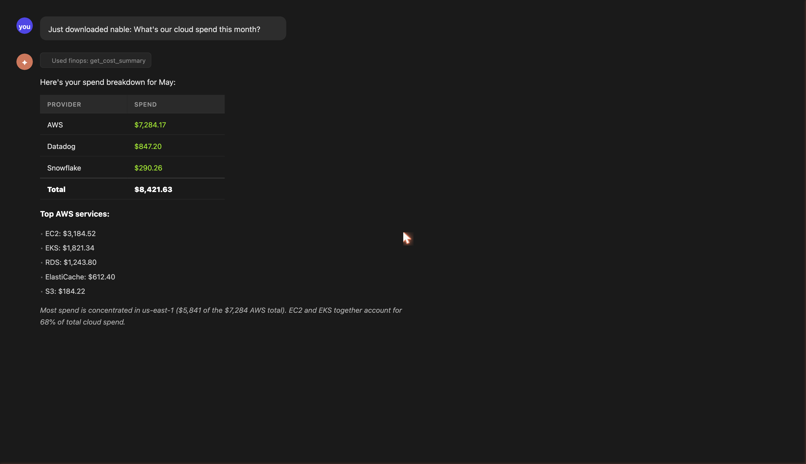

# nable: The FinOps copilot that runs on your machine

[](https://pypi.org/project/finops-mcp/)
[](https://pypi.org/project/finops-mcp/)
[](https://getnable.com/docs)

**Connect Claude to your real AWS, Azure, GCP, and SaaS billing data. Ask questions in plain English. Get answers in seconds.**

👉 **[getnable.com](https://getnable.com)** · quickstart guide, docs, and free tier



```
User: Just downloaded nable: What's our cloud spend this month?

Claude: Here's your spend breakdown:

Total: $8,421.63 / month

Provider    | Spend
------------|----------
AWS         | $7,284.17
Datadog     | $847.20
Snowflake   | $290.26

Top AWS services:
- EC2: $3,184.52
- EKS: $1,821.34
- RDS: $1,243.80
- ElastiCache: $612.40
- S3: $184.22

Most spend is concentrated in us-east-1 ($5,841 of the $7,284 AWS total).
```


---

## Quick start

**Step 1: Install and run the setup wizard**
```bash
pip install finops-mcp && finops setup
```

The wizard walks through connecting your providers and auto-configures Claude Desktop at the end. No config file editing, no manual env vars.

**On Anaconda?** Use uvx (isolated, won't touch your Anaconda environment):
```bash
brew install uv && uvx finops-mcp setup
```

**Step 2: Connect AWS (usually one keystroke)**

```bash
finops setup aws
```

The wizard checks for AWS credentials you already have (an SSO login, an AWS CLI profile, or default credentials), shows you the account it found, and connects it when you confirm. If you use `aws` on this machine already, you will not type a single key.

```
Checking for AWS credentials on this machine...
✓ Found working credentials: profile 'default' -> account 1234
  Connect this account? [Y/n]
```

Only if no working credentials are found does it walk you through creating a read-only access key. Want the IAM policy to hand your platform team first? Run `finops setup aws --iam-template`.

**Step 3: Restart Claude Desktop and ask**

```
What are my AWS costs this month?
```

Once you see a real cost breakdown, you're live. Also works with Cursor, Windsurf, and VS Code.

**Step 4 (optional): Open the visual dashboard**

```bash
finops serve
```

Opens a password-protected web dashboard at `http://localhost:8080` your whole team can view in a browser, no Claude required. Share the URL and password with your manager or exec team.

**7-day free trial, all features unlocked. No credit card required.**

---

To add more providers later:
```bash
finops setup aws      # add another AWS account
finops setup azure    # add Azure
finops setup slack    # configure alerts
finops setup license  # activate a Team plan key
finops serve          # open the visual dashboard
```

---

## What you can ask

- "What drove our AWS bill up 40% last month?"
- "Which Kubernetes namespace is over-provisioned?"
- "Are there any unusual cost spikes this week?"
- "Which EC2 instances should we downsize?"
- "Compare our cloud spend vs SaaS spend"
- "Create a Jira ticket for any EC2 waste over $200/mo"
- "Which team is spending the most on Datadog?"
- "What will our AWS bill look like next month?"
- "Show me RDS instances with low CPU that we could right-size"
- "What's our effective discount rate from Savings Plans?"

---

## Visual dashboard

```bash
finops serve
```

Starts a local web dashboard your whole team can open in a browser, no Claude Desktop required. Share it with an exec, a FinOps analyst, or anyone who needs to see costs without using an AI interface.

What it shows:
- **MTD spend** and projected month total
- **Cost trend**: 3-month historical with run-rate projection
- **Efficiency score**: composite of waste, commitment coverage, anomaly response, and tag hygiene
- **Savings opportunities**: ranked by dollar impact, each with a one-click "Mark done" to track actions taken
- **Savings pipeline**: how much has been identified vs acted on vs verified

The dashboard reads from your local provider connections. Your data stays on your machine.

```bash
# Secure with a password (recommended when sharing on a network)
FINOPS_DASHBOARD_PASSWORD=yourpassword finops serve

# Default: auto-generates a random password and prints it at startup
finops serve
```

Light mode, dark mode, and 30/60/90-day lookback are built in.

---

## How it works

Your credentials are encrypted with Fernet and stored in your OS keyring (macOS Keychain, Windows Credential Manager, or libsecret on Linux). They never leave your machine. Cost data is stored in a local SQLite database. We never see your data. Teams share findings via Slack alerts, Notion publishing, and CSV exports. No shared database required.

nable is read-only by default. It never writes to your AWS account unless you explicitly enable cleanup mode. Run `finops setup aws --iam-template` to generate a least-privilege IAM policy with exactly the permissions nable needs.

---

## Manual Claude Desktop config

If `finops setup` doesn't auto-configure, run:

```bash
finops setup claude
```

Or add manually to `claude_desktop_config.json`:

**With uvx (recommended):**
```json
{
  "mcpServers": {
    "finops": { "command": "uvx", "args": ["finops-mcp"] }
  }
}
```

**With absolute path:**
```json
{
  "mcpServers": {
    "finops": { "command": "/usr/local/bin/finops-mcp" }
  }
}
```
Use the path from `which finops-mcp`.

Config file locations:
- **macOS**: `~/Library/Application Support/Claude/claude_desktop_config.json`
- **Windows**: `%APPDATA%\Claude\claude_desktop_config.json`
- **Linux**: `~/.config/Claude/claude_desktop_config.json`

> **Why uvx?** Claude Desktop is a GUI app and doesn't inherit your shell's PATH. uvx sidesteps this by running finops-mcp in its own isolated environment. It's the most reliable option on corporate machines with managed Python installs.

---

## Connectors (17)

| Provider | What it pulls |
|---|---|
| AWS | Cost Explorer (free tier) · CUR via S3 (Team: line-item granularity, savings plans, reservations) |
| Azure | Cost Management API · Advisor cost recs · VM rightsizing (Azure Monitor) · native budgets · forecast |
| GCP | Cloud Billing API + BigQuery export |
| Datadog | Usage Metering API v2: real dollar amounts |
| Snowflake | ACCOUNT_USAGE.METERING_HISTORY |
| Langfuse | Daily metrics API: model cost, token usage, trace volume |
| MongoDB Atlas | Invoice API |
| Twilio | Usage Records API |
| Cloudflare | Billing API |
| GitHub | Actions minutes + Copilot seats |
| Vercel | Invoice API (Enterprise) |
| PagerDuty | Seat count |
| New Relic | Data ingest + user counts |

**Azure roles.** The Azure tools span three RBAC roles, granted to the service
principal on each subscription. Without them, the affected tools return empty
results (run `finops doctor` to check):

| Role | Unlocks |
|---|---|
| Cost Management Reader | cost queries, budgets, forecast, cost-by-dimension |
| Reader | Azure Advisor recommendations + VM list (rightsizing) |
| Monitoring Reader | VM CPU metrics (rightsizing) |

```bash
# repeat per subscription
az role assignment create --assignee <client-id> --role 'Cost Management Reader' --scope /subscriptions/<sub-id>
az role assignment create --assignee <client-id> --role Reader --scope /subscriptions/<sub-id>
az role assignment create --assignee <client-id> --role 'Monitoring Reader' --scope /subscriptions/<sub-id>
```

---

## What nable actually does

nable is not just a connector that pipes billing data into Claude. It runs active analysis on your infrastructure and surfaces findings as tools Claude can reason about and act on.

**AWS deep audit** goes well beyond Cost Explorer. It pulls CloudWatch metrics for every running resource and flags waste that never shows up on your bill until it's too late: gp2 volumes that should be gp3 (20% cheaper, same performance), unattached EBS volumes, idle NAT Gateways costing $32/mo in base charges, RDS backup retention set way too high, CloudWatch Log Groups with no retention policy growing forever, and Lambda functions allocated 2x the memory they actually use. Think of it as Compute Optimizer plus the layer underneath it.

**Anomaly detection** uses z-score, CUSUM drift, and day-of-week seasonal normalization. When something spikes, it drills into Cost Explorer by tag and tells you which team, environment, or service drove it. Free tier shows findings in Claude; Team adds Slack/Teams alerts and auto-ticketing.

**Rightsizing** combines AWS Compute Optimizer with nable's own CloudWatch analysis. It gives you specific recommended instance types with estimated savings, not just a list of underutilized resources. Free tier shows recommendations in Claude; Team adds ticket auto-creation.

**Commitment analysis** (Team plan) models Savings Plans and Reserved Instance coverage against your actual usage. It shows your current effective discount rate, coverage gaps, and what you would save by purchasing additional commitments.

---

## Team plan

- **Slack / Teams anomaly alerts:** get notified the moment spend spikes, not the next morning
- **Ticket auto-creation:** Jira, Linear, or GitHub issues for anomalies, rightsizing, and waste
- Cost attribution by team, service, or tag
- Scheduled email reports
- Commitment purchase recommendations with ROI projections
- Org-wide multi-account cost rollup
- Invoice email parsing via IMAP for vendors without APIs

**$40/seat/mo. 7-day free trial, no credit card required.** Subscribe at [getnable.com](https://getnable.com).

---

## Troubleshooting

```bash
finops-doctor          # checks credentials, DB, network, audit log
finops setup claude    # re-run Claude Desktop configuration only
```

| Symptom | Fix |
|---|---|
| Tools don't appear in Claude | Switch to uvx config or use absolute path |
| `command not found: finops-mcp` | Re-install with `pip install finops-mcp` or use `uvx` |
| AWS returns no data | Run `finops setup aws`. The wizard writes credentials to your editor config automatically. |
| Python 3.8/3.9 errors | nable requires Python 3.10+: `python3.10 -m pip install finops-mcp` |
| Corporate SSL errors | `pip install --trusted-host pypi.org --trusted-host files.pythonhosted.org finops-mcp` |
| Permission denied | Install to user: `pip install --user finops-mcp` or use `uvx` |
| Works at home, not at work | Use `uvx` (corporate IT often strips custom PATH entries) |

---

## Docs

Full setup guide: [getnable.com/docs](https://getnable.com/docs)

---
<sub>mcp-name: io.github.chaandannn/finops-mcp</sub>
